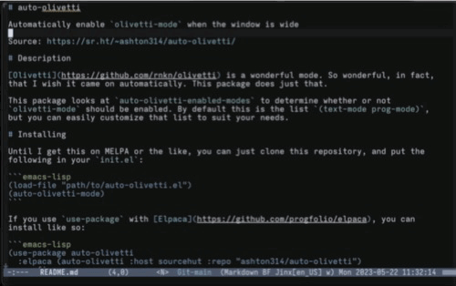

# Auto-Olivetti

Automatically enable `olivetti-mode` when the window is wide

Source: https://sr.ht/~ashton314/auto-olivetti/

# Description

[Olivetti](https://github.com/rnkn/olivetti) is a wonderful mode. So wonderful,
in fact, that I wish it came on automatically. This package does just that.



# Installing

Until I get this on MELPA or the like, you can just clone this repository, and put the following in your `init.el`:

```emacs-lisp
(load-file "path/to/auto-olivetti.el")
(auto-olivetti-mode)
```

If you use `use-package` with [Elpaca](https://github.com/progfolio/elpaca), you can install like so:

```emacs-lisp
(use-package auto-olivetti
  :elpaca (auto-olivetti :host sourcehut :repo "ashton314/auto-olivetti")
  :config
  (auto-olivetti-mode))
```

# Configuration

It's a good idea to start by customizing the value of `olivetti-body-width`. Set this as part of your `olivetti` configuration or with `setq-default` like so:

```emacs-lisp
(use-package olivetti
  :custom
  (olivetti-body-width 130))

;; OR

(setq-default olivetti-body-width 130)

(use-package auto-olivetti
  :config
  (auto-olivetti-mode))
```

(The `Customize` interface should work as well.)

## Auto-Olivetti customization options

 - `auto-olivetti-enabled-modes`
 
   List of modes for which to enable `olivetti-mode` automatically. Defaults to `'(text-mode)`. `'(text-mode prog-mode)` is pleasant.

 - `auto-olivetti-threshold-fraction`
   
   Fraction of `olivetti-body-width` at which to enable `olivetti-mode`.

 - `auto-olivetti-threshold-absolute`

   Number of columns at which to enable `olivetti-mode`.

 - `auto-olivetti-threshold-method`
   Choose between the fractional and absolute methods.
 
# Alternatives

 - [perfect-margin](https://github.com/mpwang/perfect-margin)

   I used `perfect-margin` for a little while and liked it. I found it too aggressive though, and wanted something simpler and cleaner, which is why I built this package.

# License

MIT

# Authors

 - Ashton Wiersdorf https://lambdaland.org
